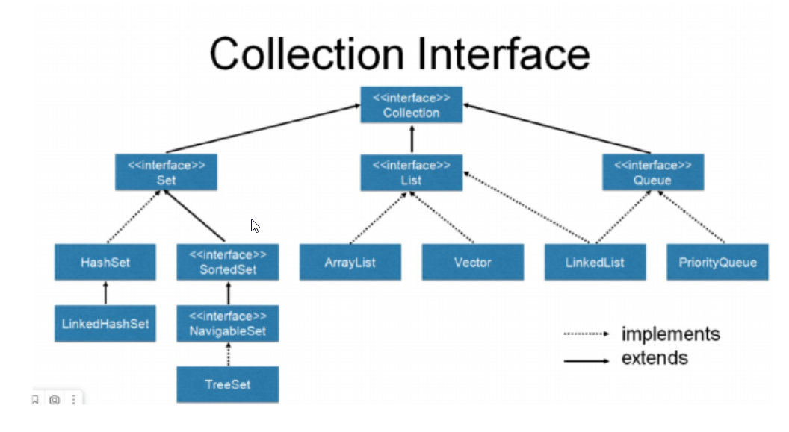

__Коллекции__

<<Interface>> Colllection

<<Interface>> Set 
   - HashSet - LinkedHashSet
   - <<Interface>> SortedSet
        <<Interface>> NavigableSet
            TreeSet

<<Interface>> List
    - <<Interface>> List
        AttayList
        Vector  

<<Interface>> Queue
    LinkedList
    PriorityQueue
        
    

__У меня есть план__
1. Тип, который может быть чем угодно
2. Обобщения
3. Массивы и их проблемы
4. Самая «простая» коллекция
5. Функционал
6. Куда двигаться дальше

__Object__
Тип данных Object – «всему голова»
Упаковка – любой тип можно положить в переменную типа Object
Распаковка – преобразование Object-переменной в нужный тип
Иерархия типов – любой тип «ниже» Object’а

__Object__

Животные
↓
Млекопитающие
↓
Приматы
↓
Человек разумный

__Иерархия коллекций. ArrayList__

List – пронумерованный набор элементов.
Пользователь этого интерфейса имеет точный контроль над тем,
где в списке вставляется каждый элемент.
Пользователь может обращаться к элементам по их целочисленному
индексу (позиции в списке) и искать элементы в списке.
URL
ArrayList, LinkedList (Vector, Stack – устаревшие)

__Коллекции. Save Type__
Ошибки на этапе компиляции лучше ошибок времени
выполнения
Повторное использование кода 

__Коллекции. Функционал__
add(args) – добавляет элемент в список ( в т.ч. на нужную позицию)
get(pos) – возвращает элемент из списка по указанной позиции
indexOf(item) – первое вхождение или -1
lastIndexOf(item) – последнее вхождение или -1
remove(pos) – удаление элемента на указанной позиции и его возвращение
set(int pos, T item) – поместить значение item элементу, который находится
на позиции pos
void sort(Comparator) – сортирует набор данных по правилу
subList(int start, int end) – получение набора данных от позиции start до end

clear() – очистка списка
toString() – «конвертация» списка в строку
Arrays.asList – преобразует массив в список
containsAll(col) – проверяет включение всех элементов из col
removeAll(col) – удаляет элементы, имеющиеся в col
retainAll(col) – оставляет элементы, имеющиеся в col
toArray() – конвертация списка в массив Object’ов
toArray(type array) – конвертация списка в массив type
List.copyOf(col) – возвращает копию списка на основе имеющегося
List.of(item1, item2,...) – возвращает неизменяемый список

__Итератор__
Получение итератора с целью более гибкой работы с данными URL
Интерфейс Iterator<E>. Итератор коллекцией. Iterator занимает место
Enumeration в Java Collections Framework. Итераторы отличаются от
перечислений двумя способами:
Итераторы позволяют вызывающей стороне удалять элементы из
базовой коллекции во время итерации с четко определенной
семантикой.
hasNext(), next(), remove()

Получение итератора с целью более гибкой работы с данными URL
Интерфейс Iterator<E>. Итератор коллекцией. Iterator занимает место
Enumeration в Java Collections Framework. Итераторы отличаются от
перечислений двумя способами:
Итераторы позволяют вызывающей стороне удалять элементы из
базовой коллекции во время итерации с четко определенной
семантикой.
hasNext(), next(), remove()
ListIterator<E> URL
hasPrevious(), E previous(), nextIndex(), previousIndex(), set(E e), add(E e)

